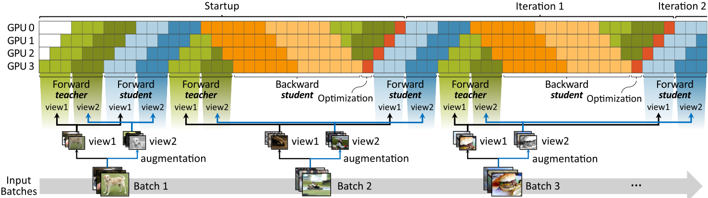

# TSPipe: Learn from Teacher Faster with Pipelines



## Benchmarks
- Knowledge Distillation (KD)
    - [Soft target](./benchmarks/soft_target)
    - [Distilbert](./benchmarks/distilbert)
- Momentum-network-based Self-Supervised Learning (SSL)
    - [BYOL](./benchmarks/byol)
    - [MoCo-v3](./benchmarks/moco-v3)


## How to install
Tested on Python 3.9.7 and PyTorch 1.12.0.

1. Install dependencies

    ```bash
    conda create -n tspipe -y python=3.9
    conda activate tspipe
    conda install -y -c pytorch pytorch torchvision torchaudio cudatoolkit=11.3 tqdm tensorboard
    conda install -y -c huggingface transformers psutil tensorboardX GitPython
    pip install timm==0.4.9
    ```

2. Configure `/etc/hosts` to enable inter-node communication. **`/etc/host` must have the entry that relates its hostname to its IP address of the network interface used for inter-node communication**.
For example, two nodes with hostname `node1` (10.0.0.1) and `node2` (10.0.0.2) should be set as:
    - `/etc/hosts` in `node1`
        ```
        127.0.0.1 localhost
        10.0.0.1 node1
        ```
    - `/etc/hosts` in `node2`
        ```
        127.0.0.1 localhost
        10.0.0.2 node2
        ```
        

3. Configure the maximum number of open files. Recommended value is 409600. You can achieve this by either of followings:
    - Add entry to `/etc/security/limits.conf` (Ubuntu)
        ```
        #<domain>   <type>  <item>  <value>
        *           soft    nofile  409600
        *           hard    nofile  409600
        ```

    -  Enter `ulimit -n 409600` in the shell before running.

## Citation
If you find paper useful for your research, please cite our paper.
```bibtex
@InProceedings{pmlr-v162-lim22a,
  title = 	 {{TSP}ipe: Learn from Teacher Faster with Pipelines},
  author =       {Lim, Hwijoon and Kim, Yechan and Yun, Sukmin and Shin, Jinwoo and Han, Dongsu},
  booktitle = 	 {Proceedings of the 39th International Conference on Machine Learning},
  pages = 	 {13302--13312},
  year = 	 {2022},
  editor = 	 {Chaudhuri, Kamalika and Jegelka, Stefanie and Song, Le and Szepesvari, Csaba and Niu, Gang and Sabato, Sivan},
  volume = 	 {162},
  series = 	 {Proceedings of Machine Learning Research},
  month = 	 {17--23 Jul},
  publisher =    {PMLR},
  pdf = 	 {https://proceedings.mlr.press/v162/lim22a/lim22a.pdf},
  url = 	 {https://proceedings.mlr.press/v162/lim22a.html},
  abstract = 	 {The teacher-student (TS) framework, training a (student) network by utilizing an auxiliary superior (teacher) network, has been adopted as a popular training paradigm in many machine learning schemes, since the seminal work—Knowledge distillation (KD) for model compression and transfer learning. Many recent self-supervised learning (SSL) schemes also adopt the TS framework, where teacher networks are maintained as the moving average of student networks, called the momentum networks. This paper presents TSPipe, a pipelined approach to accelerate the training process of any TS frameworks including KD and SSL. Under the observation that the teacher network does not need a backward pass, our main idea is to schedule the computation of the teacher and student network separately, and fully utilize the GPU during training by interleaving the computations of the two networks and relaxing their dependencies. In case the teacher network requires a momentum update, we use delayed parameter updates only on the teacher network to attain high model accuracy. Compared to existing pipeline parallelism schemes, which sacrifice either training throughput or model accuracy, TSPipe provides better performance trade-offs, achieving up to 12.15x higher throughput.}
}

```

## Credit
Some of the codes were borrowed from following repositories:
- https://github.com/kakaobrain/torchgpipe
- https://github.com/sthalles/PyTorch-BYOL
- https://github.com/facebookresearch/moco-v3
- https://github.com/AberHu/Knowledge-Distillation-Zoo
- https://github.com/huggingface/transformers